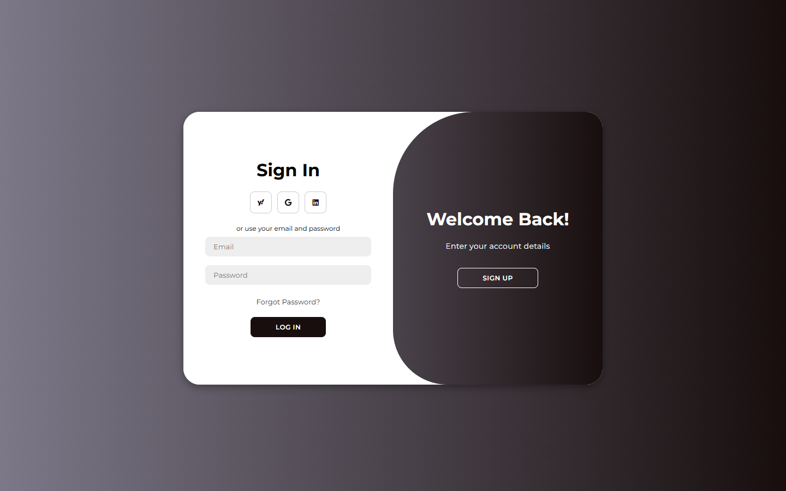
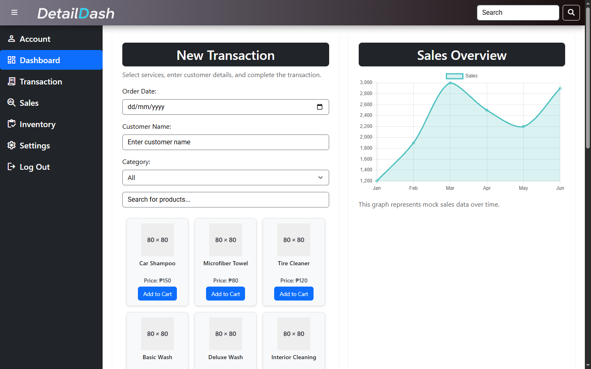
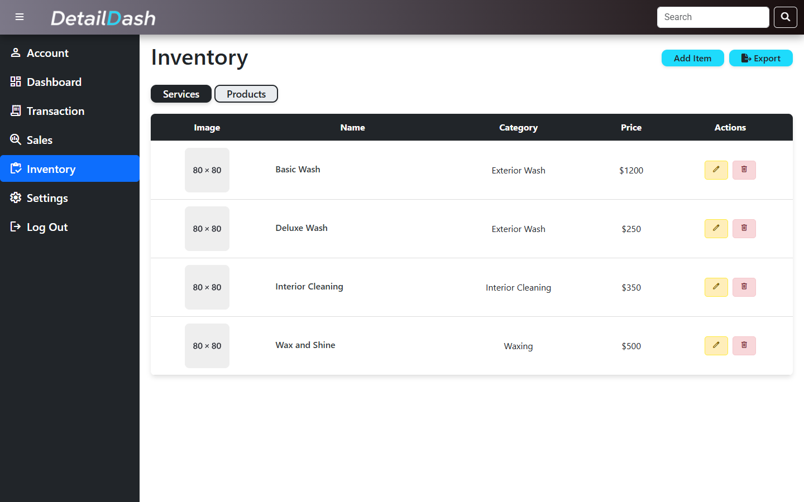
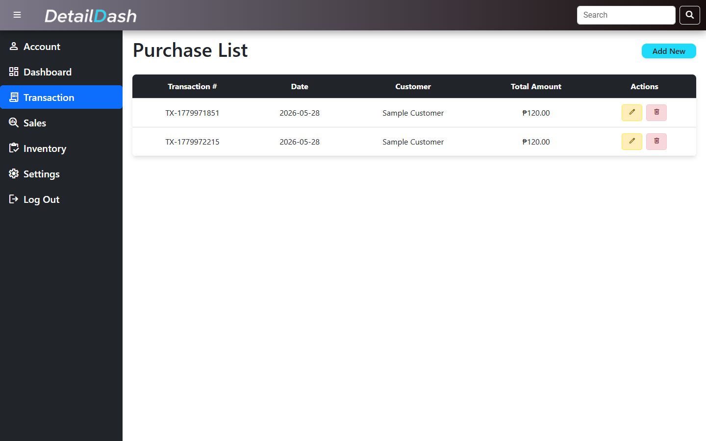

# DetailDash POS Prototype

<p>
  <a href="https://skillicons.dev">
    
  </a>
</p>

DetailDash is a Flask and SQLite point-of-sale prototype for car wash service workflows. It was built as a school project to practice routing, authentication, database-backed CRUD, inventory management, and transaction recording.

## What It Does

- Registers and signs in users with Werkzeug password hashing
- Shows dashboard, inventory, transaction, and account pages
- Manages product and service inventory through CRUD workflows
- Records transactions with customer details, cart items, payment, and totals
- Exposes Flask API routes used by the JavaScript frontend
- Seeds a local SQLite database with sample services and products

## Screenshots






## Run Locally

```powershell
cd backend
python -m venv .venv
.\.venv\Scripts\Activate.ps1
pip install -r requirements.txt
$env:SECRET_KEY="change-this-for-local-use"
python app.py
```

Open `http://localhost:5000`, create an account, then sign in.

## Project Map

```text
detaildash/
  backend/
    app.py              # Flask routes, API endpoints, auth, and page handlers
    db.py               # SQLAlchemy setup and seed data
    static/             # CSS, JavaScript, and brand assets
    templates/          # Flask templates
  docs/screenshots/     # README screenshots captured from the local app
```

The local `instance/database.db` file is generated when the app starts and is ignored by Git.

## Team Notes

This public copy was reconstructed from the strongest project branch for portfolio review. Generated files, local databases, Python cache files, duplicate legacy frontend files, and old uploaded sample assets were removed. Keep future claims focused on implemented prototype workflows, not production POS readiness.

## Verification

```powershell
python -m compileall -q backend
python -m pip_audit -r backend\requirements.txt
```

Smoke checks passed for the main pages, product/service/transaction API routes, registration, login, account display, transaction creation, and browser QA on the public screens.

## Future Improvements

- Add automated Flask route and model tests
- Add transaction editing, receipts, and exportable reports
- Add role-based access for admins and staff
- Improve empty states, form validation, and mobile responsiveness

## Resume Framing

Built a Flask and SQLite point-of-sale web application for a car wash business, implementing authentication, inventory CRUD, service/product APIs, and transaction recording.
